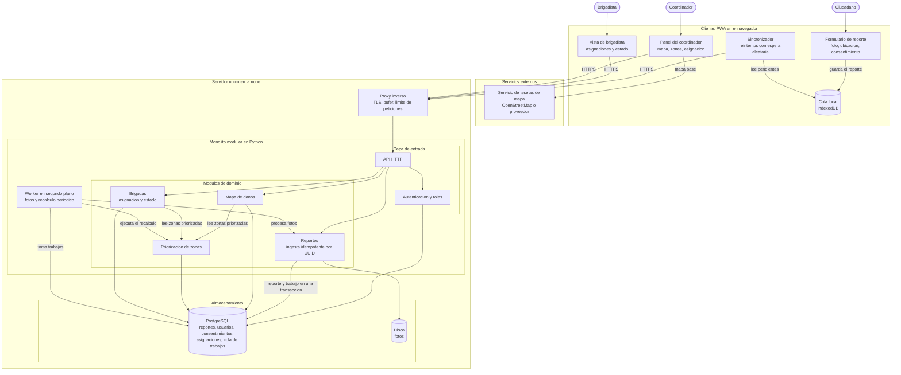

# <Nombre del caso> — Laboratorio 04: Fundamentos de arquitectura de software
Construcción de Software · EPIS-UNSA · 2026-B · Grupo 06
## Integrantes
| Nombre | Rol en el laboratorio (p. ej., redactor de ADR, diagramador, verificador de IA) |
|Oliva Valdivia David Alexander|Desarrollador,verificador de IA |
## Caso
SismoReporta AQP es una plataforma de reporte ciudadano de daños tras un sismo en Arequipa, pensada para apoyar a Defensa Civil.
El ciudadano envía reportes con foto y geolocalización desde una PWA que funciona sin señal y los reenvía al recuperarla.
El coordinador ve los daños en un mapa, recibe una priorización automática de zonas y asigna brigadas, y el brigadista actualiza el estado de su asignación.
El sistema lo construye un solo desarrollador en un mes, sobre un único servidor de bajo costo, y debe cumplir la Ley 29733 de protección de datos personales.
**Atributo de calidad crítico:** disponibilidad ante picos. Tras un sismo llegan unos 20 000 reportes en la primera hora con la red móvil congestionada, y cada reporte perdido retrasa la ayuda (QA-01).
## Arquitectura elegida

## Decisiones arquitectónicas
- [ADR-001: Estilo arquitectónico](docs/architecture/adr/001-estilo-arquitectonico.md)
- [ADR-002: Cola de Trabajos en PostgreSQL](docs/architecture/adr/002-cola-de-traajos-en-postgresql.md)
- [ADR-003: ...](docs/architecture/adr/003-pwa-offline-first.md)
## Reflexión sobre el uso de la IA (5–8 líneas)
La IA seleccionada en este caso Claude Opus 5.5 y Claude Sonnet 5.5, se encargaron de la creacion de los diagramas, el analisis de los drivers iniciales, y la construccion de la matriz de decision, ademas ayudaron a automatizar procesos como la conversion de texto a markdown.
En definitiva el trabajo se agilizo utilizandolas para los procesos que no se tiene tanto conocimiento como el uso de mermaid y de puml.